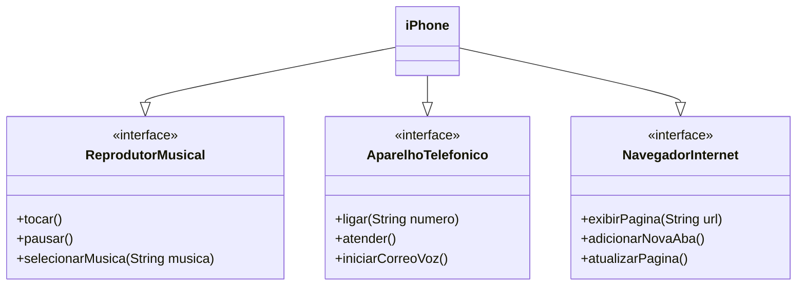

### Desafio 2 - POO
## Modelagem e Diagramação de um Componente iPhone
1. Crie um diagrama UML que represente as funcionalidades descritas acima.
2. Implementar as classes e interfaces correspondentes em Java

## Diagrama UML (Mermaid)

